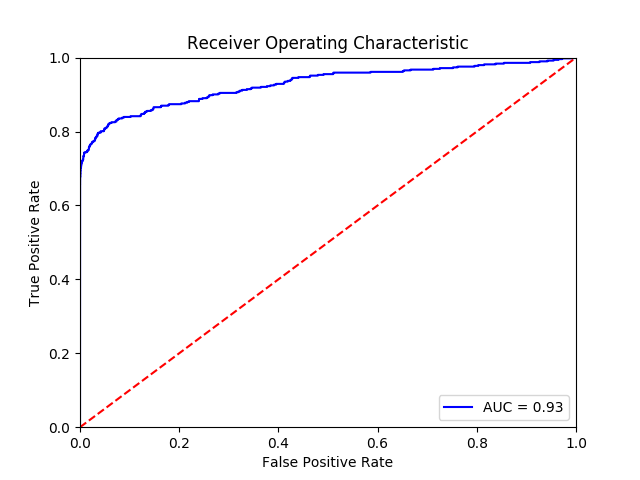
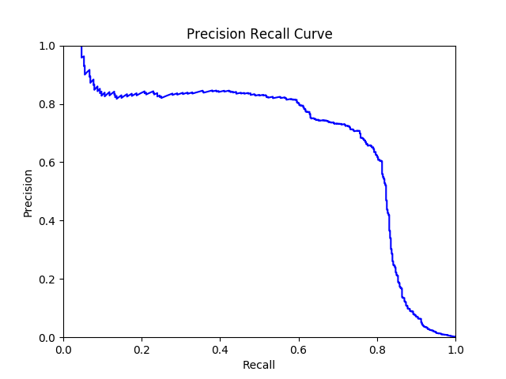

# Credit Card Fraud Analysis

[]() []() []()

Analysis of credit card fraud data using neural networks.

## Dataset

The datasets contains credit card transactions over a two day collection period in September 2013 by European cardholders. There are a total of 284,807 transactions, of which 492 (0.172%) are fraudulent.

The dataset contains numerical variables that are the result of a principal components analysis (PCA) transformation. This transformation was applied by the original authors to maintain confidentiality of sensitive information. Additionally the dataset contains `Time` and `Amount`, which were not transformed by PCA. The `Time` variable contains the seconds elapsed between each transaction and the first transaction in the dataset. The `Amount` variable is the transaction amount, this feature can be used for example-dependant cost-senstive learning. The `Class` variable is the response variable and indicates whether the transaction was fraudulant.

The dataset was collected and analysed during a research collaboration of Worldline and the [Machine Learning Group](http://mlg.ulb.ac.be) of Université Libre de Bruxelles (ULB) on big data mining and fraud detection.

_Note:_ The data file is no longer made available in this code repository. It is available in the Docker container or the [Credit Card Fraud Detection](https://www.kaggle.com/dalpozz/creditcardfraud/) Kaggle competition.

## Model

The data is split into 5 train/test sets, balanced to account for fraud being a relatively rare event. For each split, a multi-layer perceptron (MLP) neural network is fit consisting of 28 input nodes, a densely connected hidden layer with 22 nodes with S-shaped rectified linear activation and 20% dropout, and 1 output node with a sigmoid activation. The models are fit using batches of 1200 observations for up to 100 epochs, although validation loss (binary crossentropy) is monitored to permit early stopping. Stochastic optimization is performed using _Adam_.

The final model is an ensemble of the stratified k-fold neural networks, constructed by averaging the model predictions.

The models are implemented in Python using Keras and TensorFlow as the backend, although you could use Theano if you like (remember to remove the TensorBoard callback).

Run the model using the following command:

```bash
KERAS_BACKEND=tensorflow ipython src/model.py
```

## Performance

The final model achieves an overall _f1_ score of 1.00, with 95% sensitivity (recall) and 19% precision for the positive class. That is, the model correctly identifies 95% of the fraud cases (true positives) but only 19% of the transactions predicted as fraudulent were actually fraudulent. The model catches 95% of the fraudulent cases — it could identify more cases of fraud but would then also have lower precision.

#### Classification report

```
             precision    recall  f1-score   support

        0.0       1.00      0.99      1.00    284315
        1.0       0.19      0.95      0.31       492

avg / total       1.00      0.99      1.00    284807
```

#### Cross-tabulation

```
Predictions       0     1
Truth                    
0.0          282274  2041
1.0              26   466
```

#### ROC Curve



#### Precision Recall Curve



# Reference

Andrea Dal Pozzolo, Olivier Caelen, Reid A. Johnson and Gianluca Bontempi. *Calibrating Probability with Undersampling for Unbalanced Classification.* In Symposium on Computational Intelligence and Data Mining (CIDM), IEEE, 2015 ([PDF](https://www3.nd.edu/~dial/publications/dalpozzolo2015calibrating.pdf))

Diederik Kingma and Jimmy Ba. *Adam: A Method for Stochastic Optimization* Published as a conference paper at ICLR 2015 ([PDF](https://arxiv.org/pdf/1412.6980v8.pdf))

# License

The data was released under [Open Database License](http://opendatacommons.org/licenses/odbl/1.0/) and individual contents under [Database Contents License](http://opendatacommons.org/licenses/dbcl/1.0/).

This code repository is released under the [MIT "Expat" License](http://choosealicense.com/licenses/mit/).
